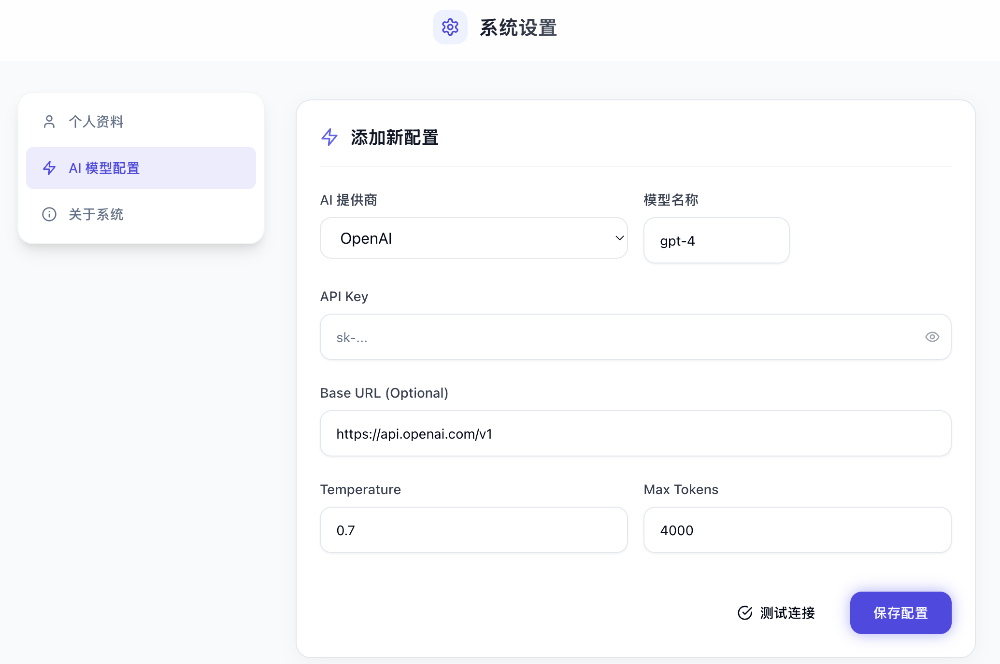
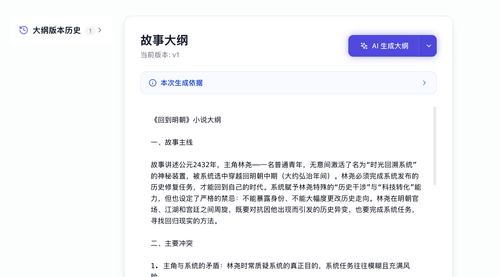
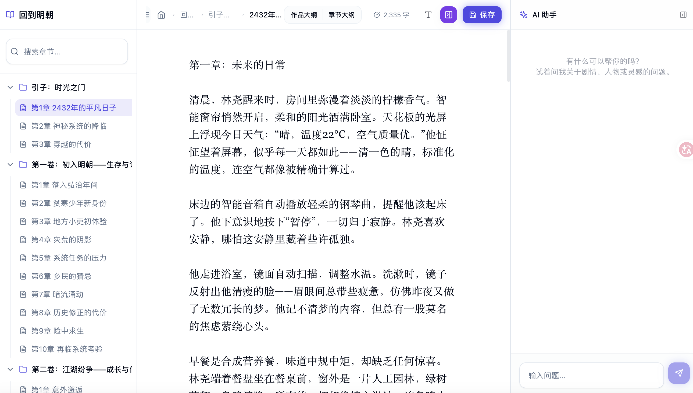

<div align="center">
  
  
  # Daer Novel
  
  **基于多智能体协作的 AI 长篇小说生成平台**
  
  从设定到连载，全流程 AI 创作系统
  
  [](LICENSE)
  [](https://www.typescriptlang.org/)
  [](https://nextjs.org/)
  [](https://expressjs.com/)
  [](https://www.postgresql.org/)
  [](https://www.docker.com/)
  
  [在线体验](https://novel.daerai.com) · [快速开始](#-快速开始) · [文档](#-文档) · [联系我们](#-联系我们)
</div>

---

## ✨ 核心特性

<table>
  <tr>
    <td width="50%">
      <h3>🤖 多智能体协作</h3>
      <p>7 个专业 AI 代理分工协作，从大纲规划到正文生成，完整覆盖小说创作流程</p>
    </td>
    <td width="50%">
      <h3>📚 结构化知识库</h3>
      <p>自动提取和管理人物、地点、道具等关键要素，保证长篇连载的世界观一致性</p>
    </td>
  </tr>
  <tr>
    <td>
      <h3>⚡ 实时进度追踪</h3>
      <p>BullMQ 异步任务队列 + WebSocket 实时推送，随时掌握生成进度</p>
    </td>
    <td>
      <h3>🎨 现代化界面</h3>
      <p>Next.js 14 + Tailwind CSS，玻璃态设计风格，优雅流畅的用户体验</p>
    </td>
  </tr>
  <tr>
    <td>
      <h3>🔌 多 AI 提供商</h3>
      <p>支持 OpenAI、Claude、DeepSeek 等主流 AI 模型，灵活配置</p>
    </td>
    <td>
      <h3>🔐 完善的认证系统</h3>
      <p>支持邮箱密码、GitHub、Google、LinuxDo 等多种登录方式</p>
    </td>
  </tr>
  <tr>
    <td>
      <h3>📱 跨平台支持</h3>
      <p>基于 Tauri 的桌面端，支持 Windows、macOS、Linux</p>
    </td>
    <td>
      <h3>🐳 容器化部署</h3>
      <p>Docker Compose 一键部署，支持生产环境快速上线</p>
    </td>
  </tr>
</table>

---

<details>
<summary><h2>📸 项目预览</h2></summary>









</details>

---

## 🚀 快速开始

### 前置要求

- **Node.js** >= 18
- **Docker** & Docker Compose
- **npm** >= 9

### 一键启动

```bash
# 1. 克隆项目
git clone https://github.com/yuwangi/daer-novel.git
cd daer-novel

# 2. 配置环境变量
cp .env.example .env
# 编辑 .env 填入你的 AI API 密钥

# 3. 运行启动脚本
chmod +x start.sh
./start.sh
```

### 访问应用

- 🌐 **前端**: http://localhost:8001
- 🔧 **后端**: http://localhost:8002
- 📖 **API 文档**: http://localhost:8002/api-docs

> 💡 详细安装指南请查看 [SETUP.md](./SETUP.md)

---

## 🏗️ 技术栈

### 后端技术

| 技术 | 用途 |
|------|------|
| Express.js | 轻量级 Web 框架 |
| PostgreSQL + pgvector | 数据库和向量检索 |
| Drizzle ORM | 类型安全的 ORM |
| BullMQ + Redis | 任务队列和缓存 |
| Socket.IO | WebSocket 实时通信 |
| Better Auth | 现代化认证框架 |

### 前端技术

| 技术 | 用途 |
|------|------|
| Next.js 14 | React 框架（App Router） |
| TypeScript | 类型安全 |
| Tailwind CSS | 原子化 CSS 框架 |
| Socket.IO Client | 实时通信客户端 |
| Tauri | 桌面端打包 |

### AI 集成

- **OpenAI** - GPT-4、GPT-3.5 Turbo
- **Anthropic** - Claude 3.5 Sonnet
- **DeepSeek** - DeepSeek Chat
- 自定义提供商抽象层

---

## 🎯 AI 代理系统

| 代理 | 功能 | 输入 | 输出 |
|------|------|------|------|
| **OutlineAgent** | 生成全文大纲 | 小说设定 | 完整故事大纲 |
| **TitleAgent** | 生成书名 | 大纲 | 3-5 个书名建议 |
| **ChapterPlanningAgent** | 章节结构规划 | 大纲 | 卷/章节结构 |
| **ChapterOutlineAgent** | 章节大纲 | 章节信息 | 章节大纲 |
| **ChapterDetailAgent** | 章节细纲 | 章节大纲 | 详细情节点 |
| **ContentAgent** | 正文生成 | 细纲 | 章节正文 |
| **ConsistencyAgent** | 一致性校验 | 生成内容 | 校验结果 |

---

## 📁 项目结构

```
daer-novel/
├── apps/
│   ├── backend/              # Express 后端
│   │   ├── src/
│   │   │   ├── database/     # 数据库配置和模型
│   │   │   ├── services/ai/  # AI 提供商和代理
│   │   │   ├── queue/        # BullMQ 任务队列
│   │   │   ├── routes/       # API 路由
│   │   │   ├── middleware/   # 中间件
│   │   │   └── utils/        # 工具函数
│   │   └── package.json
│   └── frontend/             # Next.js 前端
│       ├── app/              # 页面路由
│       ├── components/       # React 组件
│       ├── lib/              # 工具库
│       └── package.json
├── .github/workflows/        # CI/CD 配置
├── docker-compose.yml        # Docker 编排
├── .env.example              # 环境变量模板
└── README.md
```

---

## 📖 文档

- 📘 [SETUP.md](./SETUP.md) - 详细安装和配置指南
- 📗 [API.md](./API.md) - 完整 API 接口文档
- 📙 [walkthrough.md](./brain/walkthrough.md) - 功能详解和使用说明

---

## 🔧 开发指南

### 启动开发服务器

```bash
# 方式一：同时启动前后端（Web 模式）
pnpm run dev

# 方式二：桌面端开发模式（Tauri）
pnpm run tauri:dev

# 方式三：分别启动
cd apps/backend && pnpm run dev
cd apps/frontend && pnpm run dev
```

### 应用打包 (Tauri)

```bash
# 生成当前系统的安装包
pnpm run tauri:build
```

> **注意**：打包前请确保已安装 [Rust](https://www.rust-lang.org/) 环境

### 自动化发布 (GitHub Actions)

推送版本标签自动触发多平台构建：

```bash
git tag v1.0.0
git push origin v1.0.0
```

### 数据库操作

```bash
cd apps/backend

# 生成迁移
npm run migration:generate

# 执行迁移
npm run migration:run

# 填充演示数据
npm run seed
```

---

## 🧪 测试流程

1. **注册账户** - 访问 http://localhost:8001/register
2. **创建小说** - 选择类型、风格、填写背景设定
3. **生成大纲** - 进入小说详情 → 大纲标签 → AI 生成
4. **添加人物** - 人物卡标签 → 添加主角、配角
5. **生成章节** - 章节标签 → 生成章节结构
6. **查看内容** - 阅读器查看生成的正文

---

## 🤝 贡献指南

我们欢迎各种形式的贡献！

- 🐛 提交 Bug 报告
- 💡 提出新功能建议
- 📝 改进文档
- 🔧 提交代码改进

请阅读 [贡献指南](CONTRIBUTING.md) 了解详细信息。

---

## 📄 许可证

本项目采用 [MIT](LICENSE) 许可证。

---

## 🙏 致谢

- [LobeHub](https://github.com/lobehub) - 架构设计灵感
- [OpenAI](https://openai.com/) - GPT 模型支持
- [Anthropic](https://www.anthropic.com/) - Claude 模型支持
- [Better Auth](https://www.better-auth.com/) - 认证框架
- 所有开源项目贡献者

---

## 📮 联系我们

<div align="center">
  <table>
    <tr>
      <td align="center">
        <br>
        <b>个人微信</b><br>
        扫码添加，交流技术
      </td>
      <td align="center">
        <br>
        <b>微信交流群</b><br>
        加入社区，共同成长
      </td>
    </tr>
  </table>
</div>

---

<div align="center">
  <b>⭐ 如果这个项目对你有帮助，请给一个 Star！⭐</b>
  
  **开始你的 AI 创作之旅！** 🎉
</div>
